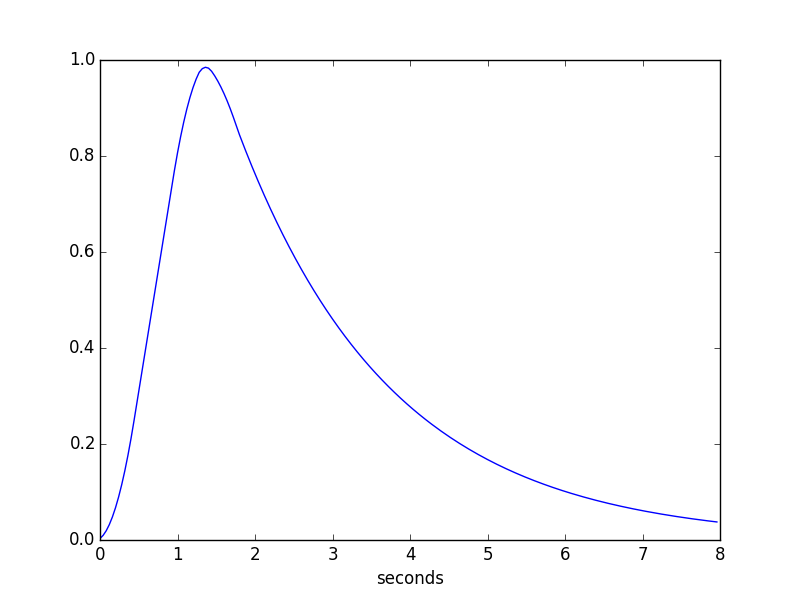
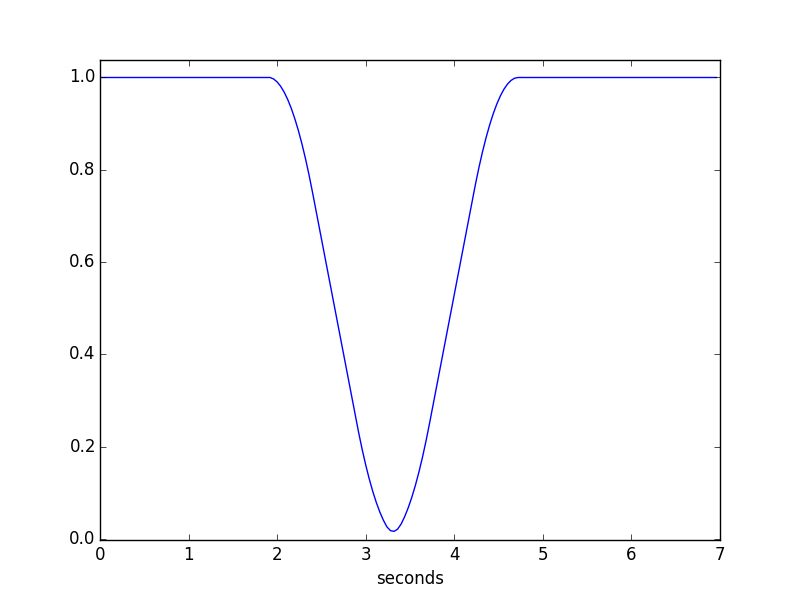
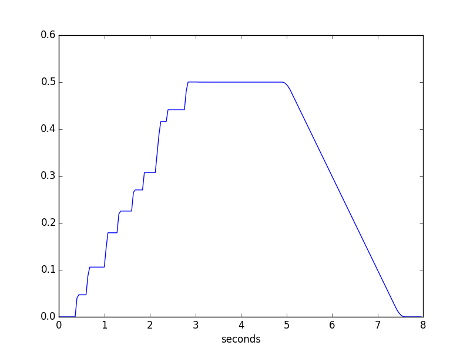

# Copyright (c) 2013-2018 Hanson Robotics, Ltd, all rights reserved. 
# `blendedNum` Package #

A collections of 'Blended' numbers, numbers that change over time according to
specified rules.

## `LiveTarget` Class ##

A number that chases a target that is free to be modified on every frame.
The function of this class closely resembles the original version of BlendedNum,
when the whole blendedNum package consisted only of one class.

## `Trajectory` Class ##

A number that moves in a pre-defined way specified by keyframes.

### Usage Examples ####

Here are some of different movement you can create using `blendednum.Trajectory`


#### Climb and Decay ####

Add keyframes with `target`s you want the number to reach and `transition`s to specify in which way you want the number interpolated.

```python
num = blendedNum.Trajectory(0)
num.add_keyframe(target=1.0, transition=[
  (0, Pipes.linear(speed=1.0)),
  (1, Pipes.moving_average(window=0.5))
])
num.add_keyframe(target=0.0, transition=(0, Pipes.exponential(alpha=0.5)))

plot_blendedNum(num, 8, 0.04)
```



The integer index in tuples indicate the slot for the pipe (which is part of the transition) to be put in. They can be overwritten in time with keyframes. For example, the graph above has a transition `[linear, moving average]` up until about `t==1.2s` after which `linear` is overwritten with `exponential` to yield the transition `[exponential, moving average]`. The fact that we don't override `moving average` on the second keyframe is the reason the tip of the graph is smooth instead of pointy.

#### Wait 2s Before Moving ####

If you don't specify the `time` argument, the blended number will move onto the next keyframe as soon as it reaches the `target`. If you *do* specify the `time` argument, that keyframe will lose influence at that time.

```python
num = blendedNum.Trajectory(1)
num.add_keyframe(target=1, time=2.0, transition=(0, Pipes.smooth(speed=1.0, smoothing=0.5)))
num.add_keyframe(target=0)
num.add_keyframe(target=1)

plot_blendedNum(num, 7, 0.04)
```



#### Sticky Climb ####

This is how the 'saccade' pipe behaves like.

```python
num = blendedNum.Trajectory(0)
num.add_keyframe(target=0.5, transition=(0, [
  Pipes.linear(speed=0.2),
  Pipes.stick(window=0.5, deviation=0.5),
  Pipes.linear(speed=1.0)
]))
num.add_keyframe(target=0.5, time=5)
num.add_keyframe(target=0.0, transition=(0, Pipes.smooth(speed=0.2, smoothing=0.2)))

plot_blendedNum(num, 8, 0.04)
```



### Note ###

Plots were drawn using the following function

```python
from rigControl import blendedNum
from rigControl.blendedNum.plumbing import Pipes

def plot_blendedNum(num, duration, dt):
  import numpy as np
  import matplotlib.pyplot as plt
  x = np.arange(0, duration, dt)
  y = [num.blend(i*duration/len(x), dt) for i in range(len(x))]
  plt.plot(x, y)
  plt.xlabel('seconds')
  plt.show()
```
